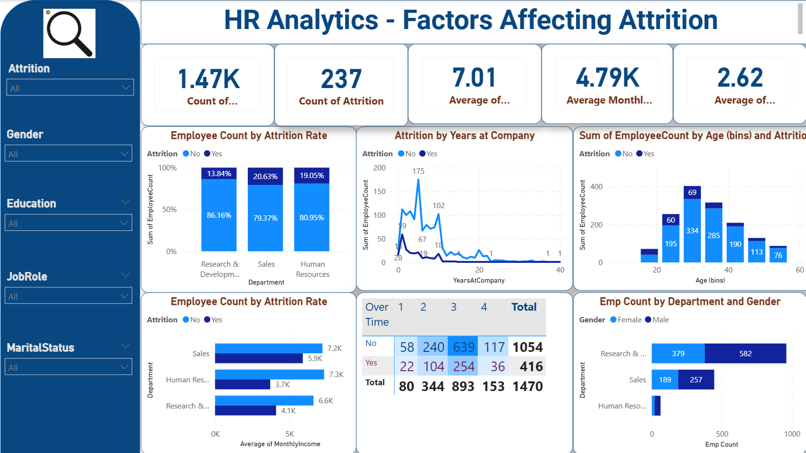
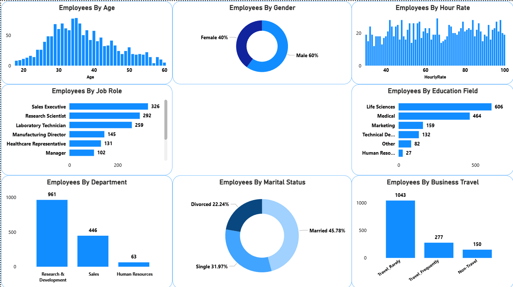

# HR-Analytics-Attrition
End-to-end HR Analytics project using Python, SQL, and Power BI to analyze employee attrition and workforce insights.

## Business Problem
Employee attrition is a critical challenge for organizations. High turnover increases recruitment costs, reduces productivity, and negatively impacts team stability.
This project analyzes employee data to identify key factors that contribute to employee attrition and provides data-driven insights to help HR teams reduce turnover.

## Project Overview

- **Objective**: Understand and predict factors influencing employee attrition  
- **Tools Used**:  
  - Python (pandas, seaborn, matplotlib) for data cleaning & EDA  
  - MySQL for querying and aggregation  
  - Power BI for interactive dashboard visualization  
- **Dataset**: IBM HR Analytics Employee Attrition & Performance (1470 rows, 35 columns) from Kaggle

## Dataset

- Source: [Kaggle - IBM HR Analytics Attrition Dataset](https://www.kaggle.com/datasets/pavansubhasht/ibm-hr-analytics-attrition-dataset)  
- Key columns: Age, Department, JobSatisfaction, MonthlyIncome, OverTime, Attrition (target), etc.  
- Data size: 1470 records, no missing values, mostly categorical and numerical features

## Methodology

### 1. Data Cleaning & Preparation
- Checked duplicates: 0 complete duplicates  
- Converted types: categorical columns to 'category' dtype  
- Created readable labels (e.g., Education → Below College / College / etc.)  

### 2. Exploratory Data Analysis (EDA)
- Visualized attrition rate (~16%)  
- Identified top factors: OverTime, JobSatisfaction, WorkLifeBalance, etc.  

### 3. SQL Analysis
- Aggregated insights using GROUP BY, WINDOW functions, etc. (see notebooks)  

### 4. Power BI Dashboard
- Interactive visuals: Attrition count card, bar charts, key influencers

## Key Insights

- Employees with **OverTime = Yes** have significantly higher attrition  
- Low **JobSatisfaction** and **EnvironmentSatisfaction** strongly correlate with leaving  
- Younger employees (<30) and those with short tenure show higher risk  

## Dashboard Preview

  

